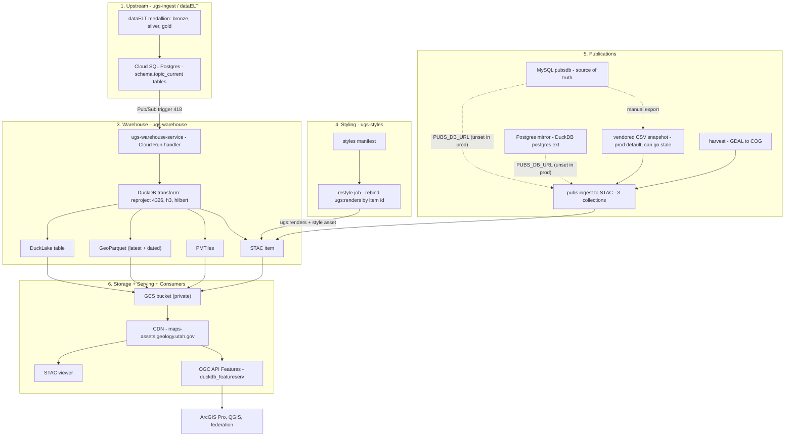

# Platform Architecture

How geologic data flows from the source databases, through the warehouse, to the maps and services
people use. The warehouse forks dataELT's published gold tables and produces cloud-native artifacts —
GeoParquet, PMTiles, DuckLake, COGs — tied together by a STAC catalog.

Legend: 🟩 built & in production · 🟧 partial / has a known gap · ⬜ not yet / blocked.

## The pipeline, layer by layer

### ① Upstream — ugs-ingest / dataELT 🟩

The warehouse does not own the data. dataELT (the ugs-ingest project) runs a dbt medallion —
bronze → silver → gold — and publishes gold as Postgres serving tables.

- Source of truth: Cloud SQL Postgres `seamlessgeolmap`, one `{schema}.{topic}_current` table per topic.
- Mart schemas scanned: `hazards`, `emp`, `gengis`, `wetlands`, `mapping`, `geochron`, `boreholes`.
- `gwportal` lives in a separate DB and is intentionally skipped.

### ② Ingest trigger — Pub/Sub #418 🟩

Every time dataELT promotes a `_current` table it publishes a `{schema, topic}` message; the
warehouse reacts. No polling, no schedule. A topic whose schema isn't a known mart is acked + skipped.

### ③ Warehouse transform + four sinks 🟩

One DuckDB streaming pass turns a Postgres serving table into cloud-native artifacts:

- Reproject every source CRS → **EPSG:4326**; add an H3 r9 cell; Hilbert-sort so Parquet row-groups
  bbox-prune well. (Unstamped SRID-0 geometry errors loudly rather than assuming 4326.)
- **Four sinks per topic:** DuckLake table · GeoParquet (`latest` + dated, citable) · PMTiles
  (tippecanoe, `-r1`) · STAC item (the discovery + linking layer).

### ④ Styling — ugs-styles 🟩

Cartographers work in the `ugs-styles` repo; styles bind into the catalog **by STAC item id**. At
STAC emit, a matching style attaches a `renders` block (MapLibre GL style URL). A `restyle` job
rebinds renders without a reingest.

### ⑤ Publications 🟧

Publications are a second producer into the same STAC catalog: scanned geologic maps become COGs +
footprints, routed into three collections (`ugs-publications`, `ugs-mining-district-files`,
`ugs-external`).

!!! note "Honest gap"
    The metadata source is pluggable via `PUBS_DB_URL` — live MySQL, live Postgres (through the
    DuckDB postgres extension), or the vendored CSV snapshot. Prod leaves `PUBS_DB_URL` **unset**, so
    it reads the **vendored CSV snapshot** checked into the repo. That snapshot is point-in-time and
    goes stale as upstream changes. Wiring a live source (MySQL or a Postgres mirror) is the open item.

### ⑥ Storage, serving & consumers 🟩

Artifacts land in one private GCS bucket and are served read-only through the **maps-assets CDN**,
which preserves object paths.

- Static surfaces (no server): GeoParquet, PMTiles, COG, STAC JSON — read directly from the CDN.
- STAC viewer: catalog browse + map + COG preview + client-side export.
- OGC API Features for ArcGIS Pro / QGIS: `duckdb_featureserv` over the GeoParquet, scale-to-zero.

## What's still open

The vector pipeline is end-to-end in production. The honest gaps:

- ⬜ **Raster consumer** — blocked on ugs-ingest #169 (open draft); the promote step is not yet implemented.
- 🟧 **Raster ingest** (soil-water time-series + one-off rasters) — the COG→STAC sink exists
  (`raster/`, tested) and lands items in `ugs-rasters`; the end-to-end consumer is gated on the
  promote step above.
- 🟧 **STAC `datetime`** is ingest time, not data-validity time — waiting on an upstream validity timestamp.
- 🟧 **Live publications source** (MySQL or Postgres mirror) instead of the vendored CSV snapshot.
- 🟧 **FGDC metadata** variant + raster extension (ISO 19139 done for vector + pubs).
