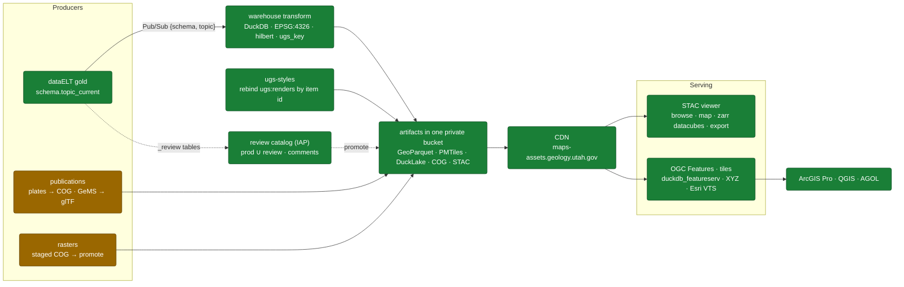

# Platform Architecture

How geologic data flows from the source databases, through the warehouse, to the maps and services
people use. The warehouse forks dataELT's published gold tables and produces cloud-native artifacts —
GeoParquet, PMTiles, DuckLake, COGs — tied together by a STAC catalog.

Legend: 🟩 built & in production · 🟧 partial / has a known gap · ⬜ not yet / blocked.



!!! tip "The detailed diagram is generated, not hand-typed"
    This page keeps the simplified spine. The full graph — every deployed Cloud Run service, the
    publications jobs, the review path — is generated from `viewer/src/shell/architecture-model.ts` and
    rendered on the viewer's **Architecture** page, where a test asserts it still covers everything
    `cloudbuild.yaml` deploys. Hand-copying that detail here is what let this page drift.

## The pipeline, layer by layer

### ① Upstream — ugs-ingest / dataELT 🟩

The warehouse does not own the data. dataELT (the ugs-ingest project) runs a dbt medallion —
bronze → silver → gold — and publishes gold as Postgres serving tables.

- Source of truth: Cloud SQL Postgres `seamlessgeolmap`, one `{schema}.{topic}_current` table per topic.
- Mart schemas scanned: `hazards`, `emp`, `gengis`, `wetlands`, `mapping`, `geochron`, `boreholes`.
- `gwportal` lives in a separate DB and is intentionally skipped.

### ② Ingest trigger — Pub/Sub #418 🟩

Every time dataELT promotes a `_current` table it publishes a `{schema, topic}` message; the
warehouse reacts. No polling, no schedule. A topic whose schema isn't a known mart is acked + skipped.

### ③ Warehouse transform + four sinks 🟩

One DuckDB streaming pass turns a Postgres serving table into cloud-native artifacts:

- Reproject every source CRS → **EPSG:4326**; add an H3 r9 cell; Hilbert-sort so Parquet row-groups
  bbox-prune well. (Unstamped SRID-0 geometry errors loudly rather than assuming 4326.)
- **Four sinks per topic:** DuckLake table · GeoParquet (`latest` + dated, citable) · PMTiles
  (tippecanoe, `-r1`) · STAC item (the discovery + linking layer).
- **Durable key.** A topic whose serving table carries `ugs_key` gets DuckLake delta-MERGEs keyed on
  it (instead of a full rewrite) and a `ugs:primary_key` STAC stamp, so a row comment resolves to the
  same feature across reingests. The feature **id** stays `feature_id` — promoting `ugs_key` to the
  MVT/OGC id has to land with the viewer's id-column switch, so it's a follow-up.

### ④ Styling — ugs-styles 🟩

Cartographers work in the `ugs-styles` repo; styles bind into the catalog **by STAC item id**. At
STAC emit, a matching style attaches a `renders` block (MapLibre GL style URL). A `restyle` job
rebinds renders without a reingest.

### ⑤ Publications 🟧

Publications are a second producer into the same STAC catalog: scanned geologic maps become COGs +
footprints, routed into three collections (`ugs-publications`, `ugs-mining-district-files`,
`ugs-external`).

Publication **files** (PDFs, plate/GIS zips, tables) are hosted on `ugspub.nr.utah.gov`, not by us.
`pubs/mirror.py` copies a selected slice into the bucket under `pubs/files/` — path-preserving, so
the legacy URL's path *is* the object path. A mirrored file's asset serves from our CDN and keeps
the publisher's URL as an `alternate`; unmirrored files stay linked to the publisher.

```bash
python -m ugs_warehouse.pubs.mirror --dry-run   # default slice: pubs with a harvested COG
python -m ugs_warehouse.pubs.mirror             # then re-run pubs.ingest to repoint the assets
```

!!! note "Honest gaps"
    **Metadata source.** Pluggable via `PUBS_DB_URL` — live MySQL, live Postgres (through the
    DuckDB postgres extension), or the vendored CSV snapshot. Prod leaves `PUBS_DB_URL` **unset**, so
    it reads the **vendored CSV snapshot** checked into the repo. That snapshot is point-in-time and
    goes stale as upstream changes. Wiring a live source (MySQL or a Postgres mirror) is the open
    item (#121).

    **File hosting.** The mirror is selective by design (#120): map pubs only, ~81 GB of a ~200 GB
    full mirror. Everything else still depends on the legacy host, which sends no CORS header — so
    browser code can navigate to those files but never read their bytes.

### ⑥ Storage, serving & consumers 🟩

Artifacts land in one private GCS bucket and are served read-only through the **maps-assets CDN**,
which preserves object paths.

- Static surfaces (no server): GeoParquet, PMTiles, COG, Zarr, STAC JSON — read directly from the CDN.
- STAC viewer: catalog browse + map + COG preview + zarr datacube layers + client-side export.
- OGC API Features for ArcGIS Pro / QGIS: `duckdb_featureserv` over the GeoParquet, scale-to-zero.
- `ugs-warehouse-tiles`: XYZ tiles, ready-made MapLibre styles, and an Esri VectorTileServer facade
  so AGOL and Pro can add a layer at all.
- Background jobs: topic thumbnails, the `restyle` rebind, and weekly DuckLake maintenance.
- External catalogs (USWB) federate in as children of the root, so one catalog URL covers them.

### ⑦ Review path 🟩

The same pipeline against `_review` serving tables, written under `review/` prefixes and served
behind IAP. The review app federates prod ∪ review and takes comments at item, column and row level;
promotion turns a thread into read-only history rather than deleting it.

## What's still open

The vector pipeline is end-to-end in production. The honest gaps:

- 🟧 **Raster path** — consume/promote is deployed and provisioned (#61 closed 2026-07-26), and the
  COG→STAC sink lands items in `ugs-rasters`. What's left is quality, not wiring: promoted items
  don't render on the viewer map because the visual asset is the native-CRS COG (#84), `native_crs`
  is trusted text that's never verified against the promoted COG (#83), and promote shares an
  instance with ingest with no dead-letter policy, so one bad message is an outage (#81).
- 🟧 **STAC `datetime`** is ingest time, not data-validity time — waiting on an upstream validity timestamp.
- 🟧 **Live publications source** (MySQL or Postgres mirror) instead of the vendored CSV snapshot (#121).
- 🟧 **Publication files** — only the map-pub slice is mirrored; the rest live on the legacy host (#120).
- 🟧 **FGDC metadata** variant + raster extension (ISO 19139 done for vector + pubs).
