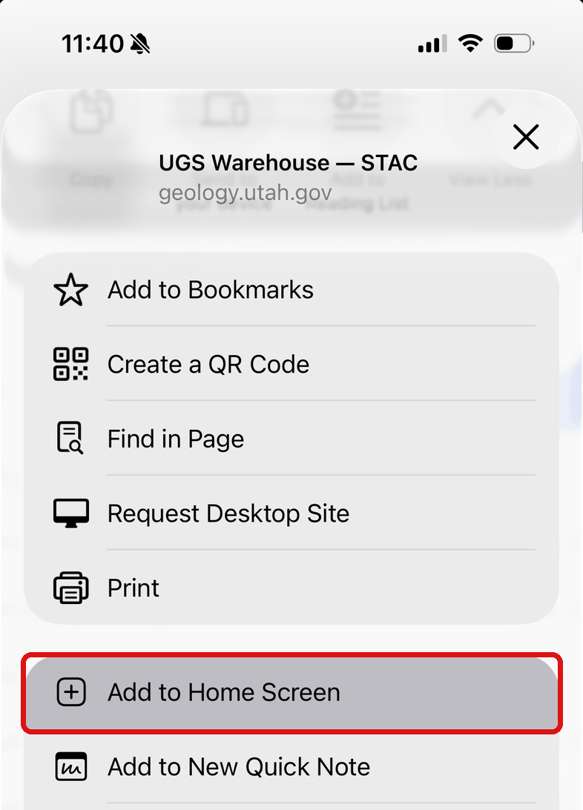
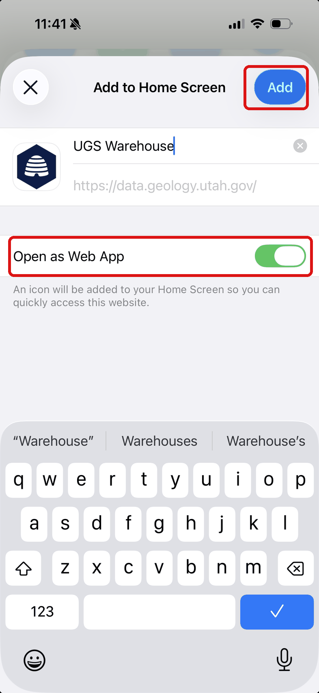
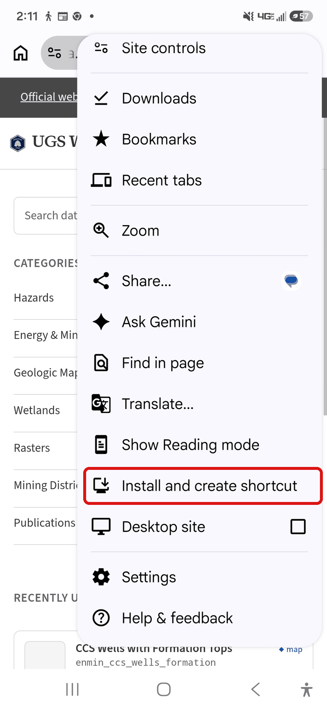
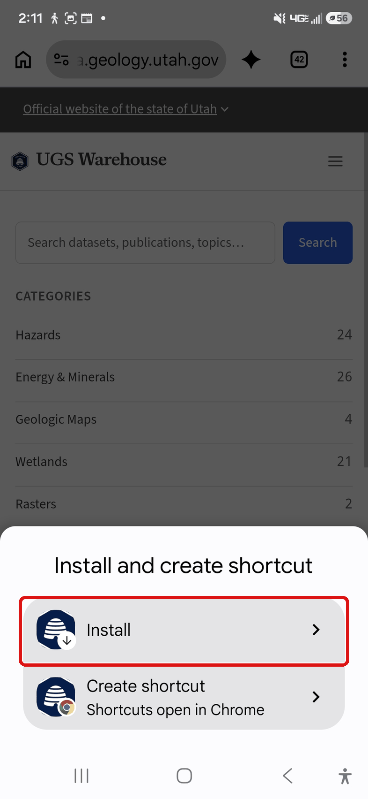
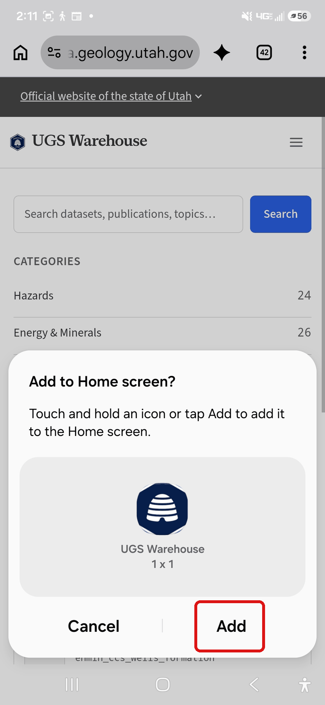
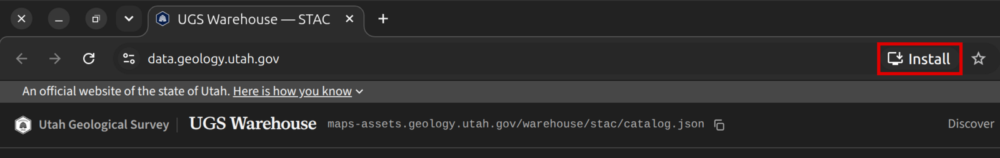
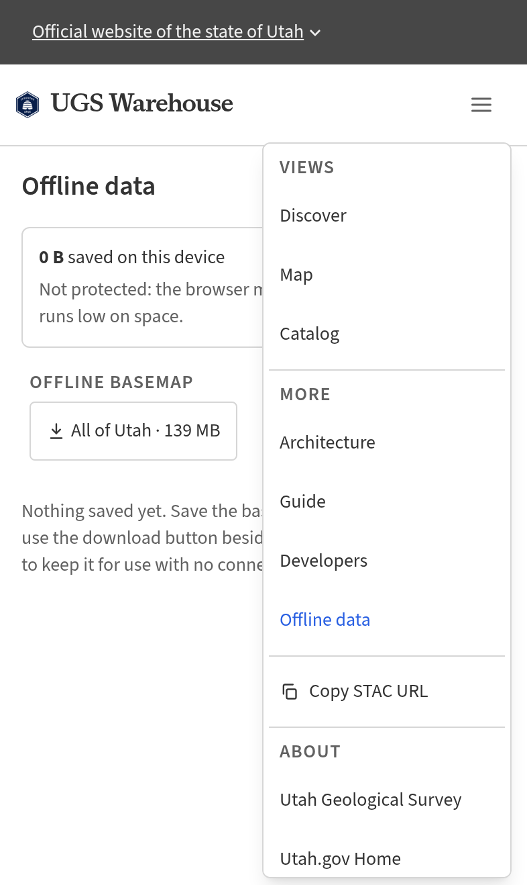
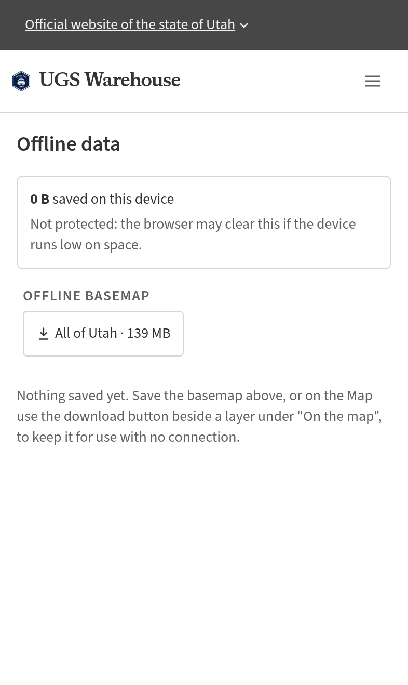
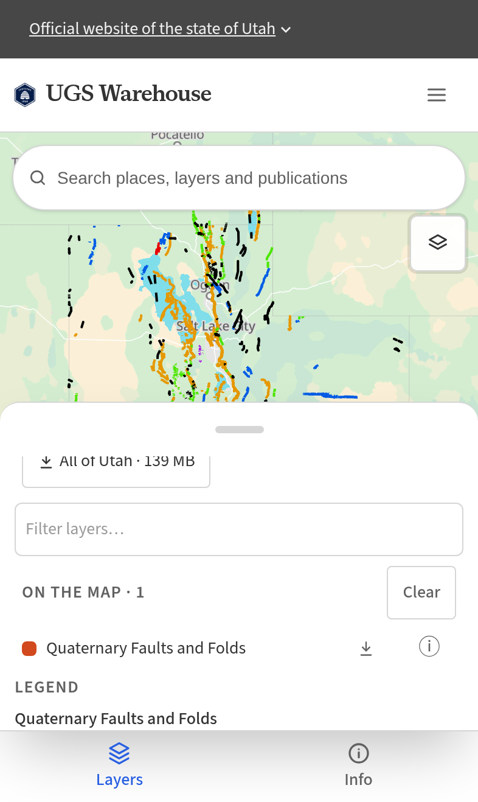

# UGS Warehouse User Guide

This guide shows how to open UGS geologic data in common tools. The data is public. You do not
need an account.

> The examples use the **`hazards_qfaults`** layer (Quaternary faults). To use a different layer,
> replace that id with an id from the [catalog](#find-a-layer).

---

## What is published

Each layer is available in more than one file format. You give your tool a URL. You do not need
to convert the data.

| Format | Contents | Use with | URL pattern |
|---|---|---|---|
| **GeoParquet** | The full vector dataset in one file | Python, R, DuckDB, GDAL, BI tools | `…/warehouse/geoparquet/{id}/{id}.parquet` |
| **PMTiles** | Vector map tiles in one file | Web maps, QGIS | `…/warehouse/pmtiles/{id}/{id}.pmtiles` |
| **COG** | Cloud Optimized GeoTIFF of a scanned geologic map | QGIS, ArcGIS Pro, rasterio | `…/geolmap/cogs/{series}.cog.tif` |
| **STAC** | The catalog of all layers and maps (JSON) | Finding data, scripts | `…/warehouse/stac/catalog.json` |
| **OGC API Features** | A feature service that you can query | ArcGIS Pro, QGIS, ArcGIS Online | `…/collections/{id}/items` on the service below |

All file URLs start with **`https://maps-assets.geology.utah.gov`**.

All layers use **EPSG:4326** (WGS 84 longitude and latitude).

GeoParquet files have `bbox_xmin`, `bbox_ymin`, `bbox_xmax` and `bbox_ymax` columns. When you
filter on these columns, tools such as DuckDB read only the rows in your area.

> The OGC API Features service is at
> `https://ugs-warehouse-features-xedvkyurga-uc.a.run.app`. The collection id is the same as the
> layer id.

---

## Find a layer

1. Open <https://data.geology.utah.gov/> and click **Catalog**, or use the search box.
2. Open a layer or a geologic map. The page shows a map preview, the fields and the metadata.
3. Under **Downloads** and **Services**, copy the URL for the format that your tool uses. Each URL
   has a **copy** button.

The layer id, for example `hazards_qfaults`, is the last part of the GeoParquet and PMTiles URLs.
For a scanned geologic map, the COG URL is under **Services** on the map's page.

---

## Metadata and citation

### Metadata and fields

Each layer page in the viewer shows the layer's description and other metadata. **Data schema**
lists each field and its data type. Under **Downloads**, each layer has an ISO 19139 metadata file
(XML) that you can load into ArcGIS Pro or a metadata catalog.

### Citation

The GeoParquet URL always points to the latest data. Each layer also has dated copies that do not
change, next to the latest file: `…/{id}/{id}_YYYYMMDD.parquet`. The date is the day the layer was
updated. Cite a dated copy when other people must get the same data.

---

## Pick your tool

- [Web viewer](#web-viewer): browse and download in a browser, with no install
- [ArcGIS Pro](#arcgis-pro)
- [QGIS](#qgis)
- [Python](#python)
- [R](#r)
- [DuckDB](#duckdb)
- [GDAL and ogr2ogr](#gdal-and-ogr2ogr)
- [BI tools (Tableau, Power BI)](#bi-tools)
- [Find layers with a script](#find-layers-with-a-script)

---

## Web viewer

Open <https://data.geology.utah.gov/>.

- Browse and search the catalog, and filter layers by attribute.
- Open a layer to see it on a map and in a data table. You can sort and filter the table.
- Select a feature on the map to highlight its row in the table, and the reverse.
- Export a layer, or the part in your map view, to Shapefile, GeoPackage, File Geodatabase,
  FlatGeobuf, GeoJSON or CSV. You can choose the coordinate system, for example NAD83 / UTM zone 12N
  (EPSG:26912). The export runs in your browser.

Use the viewer to look at data, download a layer once, or share a link. For work that you repeat,
or for large data, use one of the tools below.

---

## Use the viewer offline

You can save the basemap and layers on your device and use them with no signal. First install the
app, then save data in the app.

### Install on iPhone and iPad (Safari)

**Note:** On iPhone and iPad, install the app from Safari. These steps do not apply to Chrome or
other browsers on iOS.

You need iOS or iPadOS 26 or later. Do not save data in a Safari tab: the Home Screen app keeps
its own storage, so that data does not show in the app, and Safari can delete it after 7 days
with no visit.

1. Open <https://data.geology.utah.gov/> in Safari.
2. Tap **Share**, then tap **Add to Home Screen**.
3. Make sure **Open as Web App** is on, then tap **Add**.
4. Open **UGS Warehouse** from your Home Screen, then go to [Save data](#save-data-for-offline-use).

{ width="320" }
{ width="320" }

### Install on Android (Chrome)

1. Open <https://data.geology.utah.gov/> in Chrome.
2. Tap the **⋮** menu, then tap **Install and create shortcut**.
3. Tap **Install**. Do not tap **Create shortcut**: a shortcut opens in Chrome, not as an app.
4. If your phone asks to add the icon to the Home screen, tap **Add**.
5. Open **UGS Warehouse** from your Home screen, then go to [Save data](#save-data-for-offline-use).

{ width="320" }
{ width="320" }
{ width="320" }

### Install on a computer (Chrome or Edge)

1. Open <https://data.geology.utah.gov/> in Chrome or Edge.
2. Click **Install** at the right of the address bar, then click **Install** in the window that
   opens. In Chrome, if you do not see **Install**, open the **⋮** menu and click
   **Cast, save, and share** > **Install page as app**.
3. The app opens in its own window. Go to [Save data](#save-data-for-offline-use).

{ width="640" }

### Save data for offline use

1. Open the menu and tap **Offline data**.
2. Under **Offline basemap**, tap **All of Utah** to save the full basemap.
3. To save a layer, go to **Map**, open **Layers**, and turn the layer on. Under **On the map**,
   tap the download button beside the layer.

{ width="320" }
{ width="320" }
{ width="320" }

To save only part of the state, zoom in on the map and tap **Save this area** under
**Offline basemap**.

Downloads run one at a time. If you close the app or lose signal, the download continues from
where it stopped the next time you open the app. The **Offline data** page shows what is saved,
how much space it uses, and lets you delete it.

---

## ArcGIS Pro

ArcGIS Pro 3.2 or later is recommended.

### Vector layers (OGC API Features)

1. Click **Insert** > **Connections** > **Server** > **New OGC API Server**. You can also
   right-click **Servers** in the Catalog pane.
2. For the server URL, enter `https://ugs-warehouse-features-xedvkyurga-uc.a.run.app`.
3. Expand the connection and drag a collection, for example `hazards_qfaults`, onto the map. Pro
   queries the service as you pan and zoom. It does not download the full layer.

### Vector tiles with UGS symbology

Each layer that has a published style is also an ArcGIS vector tile service. The tiles draw with
the UGS symbology. You cannot query or edit the features.

1. Click **Add Data** > **Data From Path**.
2. Paste the service URL, for example
   `https://ugs-warehouse-tiles-xedvkyurga-uc.a.run.app/rest/services/hazards_qfaults/VectorTileServer`.

You can copy this URL from **Services** > **ArcGIS vector tiles** on the layer page in the viewer.

### Geologic map rasters (COG)

1. Click **Add Data** > **Data From Path**.
2. Paste the COG URL, for example
   `https://maps-assets.geology.utah.gov/geolmap/cogs/M-299DM.cog.tif`.

Pro reads only the part of the COG that is in your map view.

### Find data

Pro's STAC connection needs a STAC API that you can search. This catalog is a set of static files,
so Pro cannot connect to it. Find a layer or map in the [web viewer](#find-a-layer), then add its
URL as shown above.

> Pro support for Parquet files depends on the Pro version. For vector layers, use the OGC API
> connection. To get a file geodatabase, export from the [web viewer](#web-viewer) or use
> [ogr2ogr](#gdal-and-ogr2ogr).

---

## QGIS

QGIS 3.34 or later is recommended.

### Vector layers (OGC API Features)

In the Browser panel, right-click **WFS / OGC API - Features** and click **New Connection**. Enter
the URL `https://ugs-warehouse-features-xedvkyurga-uc.a.run.app`. Expand the connection and add
the `hazards_qfaults` layer.

### GeoParquet

Click **Layer** > **Add Layer** > **Add Vector Layer**. Set the source type to **Protocol:
HTTP(S), cloud, etc.**, or enter this path:
```
/vsicurl/https://maps-assets.geology.utah.gov/warehouse/geoparquet/hazards_qfaults/hazards_qfaults.parquet
```
Your QGIS install must include the GDAL Parquet driver.

### PMTiles

Click **Layer** > **Add Layer** > **Add Vector Tile Layer** > **New Generic Connection**. Enter
this URL:
```
pmtiles://https://maps-assets.geology.utah.gov/warehouse/pmtiles/hazards_qfaults/hazards_qfaults.pmtiles
```
If the layer has a published UGS style, enter the style URL in the **Style URL** box of the same
connection to draw the layer with UGS symbology:
```
https://maps-assets.geology.utah.gov/styles/styles/hazards_qfaults/default.json
```

### Geologic map rasters (COG)

Click **Layer** > **Add Layer** > **Add Raster Layer** and set the source type to **Protocol:
HTTP(S), cloud, etc.**, or enter this path:
```
/vsicurl/https://maps-assets.geology.utah.gov/geolmap/cogs/M-299DM.cog.tif
```

---

## Python

Use DuckDB to query a file without downloading all of it, or GeoPandas to get a GeoDataFrame.

### DuckDB in Python
```python
import duckdb
con = duckdb.connect()
con.execute("INSTALL httpfs; LOAD httpfs; INSTALL spatial; LOAD spatial;")

URL = "https://maps-assets.geology.utah.gov/warehouse/geoparquet/hazards_qfaults/hazards_qfaults.parquet"

# Attributes only
df = con.execute(f"SELECT * EXCLUDE (geom) FROM read_parquet('{URL}') LIMIT 1000").df()

# Features that overlap a bounding box. The bbox columns let DuckDB skip most of the file.
rows = con.execute(f"""
    SELECT *, ST_AsText(geom) AS wkt
    FROM read_parquet('{URL}')
    WHERE bbox_xmin < -111.8 AND bbox_xmax > -112.0
      AND bbox_ymin <  41.0 AND bbox_ymax >  40.8
""").df()
```

### GeoPandas
```python
import geopandas as gpd
gdf = gpd.read_parquet("https://maps-assets.geology.utah.gov/warehouse/geoparquet/hazards_qfaults/hazards_qfaults.parquet")
gdf.plot()
```
To read from a URL, GeoPandas needs `fsspec` and `aiohttp`. You can also download the file first.

### Finding data with pystac
```python
import pystac
cat = pystac.Catalog.from_file("https://maps-assets.geology.utah.gov/warehouse/stac/catalog.json")
for child in cat.get_children():
    print(child.id)
```

---

## R

### sf
```r
library(sf)
url <- "/vsicurl/https://maps-assets.geology.utah.gov/warehouse/geoparquet/hazards_qfaults/hazards_qfaults.parquet"
faults <- st_read(url)  # GDAL must include the Parquet driver
plot(st_geometry(faults))
```

### DuckDB in R
```r
library(duckdb); library(DBI)
con <- dbConnect(duckdb())
dbExecute(con, "INSTALL httpfs; LOAD httpfs; INSTALL spatial; LOAD spatial;")
url <- "https://maps-assets.geology.utah.gov/warehouse/geoparquet/hazards_qfaults/hazards_qfaults.parquet"
df  <- dbGetQuery(con, sprintf(
  "SELECT *, ST_AsText(geom) AS wkt FROM read_parquet('%s') LIMIT 1000", url))
```

### List every layer id
```r
library(jsonlite)
idx <- fromJSON("https://maps-assets.geology.utah.gov/warehouse/stac/ugs-serving-topics/items.json")
idx$items$id
```

---

## DuckDB

These examples work in the DuckDB CLI and in any DuckDB client library.

```sql
INSTALL httpfs; LOAD httpfs;
INSTALL spatial; LOAD spatial;

-- First 10 rows, without geometry
SELECT * EXCLUDE (geom)
FROM read_parquet('https://maps-assets.geology.utah.gov/warehouse/geoparquet/hazards_qfaults/hazards_qfaults.parquet')
LIMIT 10;

-- Count the features that overlap a bounding box
SELECT count(*)
FROM read_parquet('https://maps-assets.geology.utah.gov/warehouse/geoparquet/hazards_qfaults/hazards_qfaults.parquet')
WHERE bbox_xmin < -111.8 AND bbox_xmax > -112.0
  AND bbox_ymin <  41.0 AND bbox_ymax >  40.8;

-- Export to CSV with the geometry as WKT
COPY (
  SELECT * EXCLUDE (geom), ST_AsText(geom) AS wkt
  FROM read_parquet('https://maps-assets.geology.utah.gov/warehouse/geoparquet/hazards_qfaults/hazards_qfaults.parquet')
) TO 'faults.csv' (HEADER);
```

---

## GDAL and ogr2ogr

Use ogr2ogr to convert a layer to another format from the command line.

```bash
# GeoParquet to GeoPackage
ogr2ogr -f GPKG faults.gpkg \
  /vsicurl/https://maps-assets.geology.utah.gov/warehouse/geoparquet/hazards_qfaults/hazards_qfaults.parquet

# GeoParquet to Shapefile, clipped to a bounding box (west south east north)
ogr2ogr -f "ESRI Shapefile" faults_clip.shp \
  /vsicurl/https://maps-assets.geology.utah.gov/warehouse/geoparquet/hazards_qfaults/hazards_qfaults.parquet \
  -spat -112.0 40.8 -111.8 41.0

# Show information about a COG
gdalinfo /vsicurl/https://maps-assets.geology.utah.gov/geolmap/cogs/M-299DM.cog.tif
```

---

## BI tools

Tableau, Power BI and Excel work well with layer attributes. Their support for geometry is
limited, so use a GIS tool for maps.

The GeoParquet files and the CSV export from the [web viewer](#web-viewer) both have
`bbox_xmin` and `bbox_ymin` columns. For a point layer, these columns are the longitude and
latitude of each point. The CSV also has the geometry as WKT text.

### Power BI

Click **Get Data** > **Parquet** (or **Web**) and enter a GeoParquet URL, or load a CSV export. In
a map visual, use `bbox_xmin` as longitude and `bbox_ymin` as latitude.

### Tableau

Load a CSV export and plot points with `bbox_xmin` as longitude and `bbox_ymin` as latitude. For
line and polygon layers, convert to GeoPackage with [ogr2ogr](#gdal-and-ogr2ogr) and use Tableau's
spatial file connector.

You can use DuckDB to filter rows, select columns or drop the geometry before you load the data.

---

## Find layers with a script

- Open the STAC catalog in any STAC tool:
  `https://maps-assets.geology.utah.gov/warehouse/stac/catalog.json`
- List every layer id with DuckDB:
  ```sql
  SELECT item.id FROM read_json_auto(
    'https://maps-assets.geology.utah.gov/warehouse/stac/ugs-serving-topics/items.json'
  ) t, UNNEST(t.items) AS u(item)
  ```
- The layer id, for example `hazards_qfaults` or `enmin_oilgasfields_ogm`, goes in each URL
  pattern above. It is also the OGC API collection id and the STAC item id.

Each layer's STAC item lists its fields (`table:columns` on the data asset), its categories and
colors (`classification:classes`), its CRS and extent, and links to each format. You can use the
catalog in scripts instead of hard-coded URLs.

---

If a layer does not load, or you have a question, contact the Utah Geological Survey.
